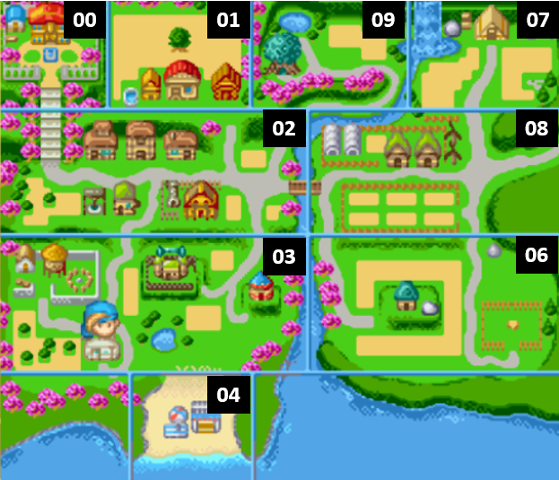

# Location information

## Important memory locations
Character Location: 0x023D7AD8 (NA1.0) | 0x023D7AD4 (NA1.1)
Screen Location: 0x023D3AC0 (NA1.0) |  0x023D3AB0 (NA1.1)
Character X: 0x023D3E71 (NA1.0)
Character Y: 0x023D3E75 (NA1.0)
Screen X: 0x023D7AD4 (NA1.0)
Screen Y: 0x023D7AD6 (NA1.0)

### Map location table

|    	|                                             	|    	|                                 	|    	|                            	|
|----	|---------------------------------------------	|----	|---------------------------------	|----	|----------------------------	|
| 0  	| Outside (see map)                           	| 1  	| Outside (see map)               	| 2  	| Outside (see map)          	|
| 3  	| Outside (see map)                           	| 4  	| Outside (see map)               	| 5  	| Island                     	|
| 6  	| Outside (see map)                           	| 7  	| Outside (see map)               	| 8  	| Outside (see map)          	|
| 9  	| Outside (see map)                           	| A  	| Mansion main floor              	| B  	| Romana's room              	|
| C  	| Sebastian's room                            	| D  	| Mansion kitchen                 	| E  	| Mansion upstairs           	|
| F  	| Lumina's room                               	| 10 	| Witch's hut                     	| 11 	| Wally's house              	|
| 12 	| Wally's upstairs                            	| 13 	| Grant's house                   	| 14 	| Grant's upstairs           	|
| 15 	| Dr. Hardy's House                           	| 16 	| Bar                             	| 17 	| Griffin's room             	|
| 18 	| Muffy's room                                	| 19 	| Ruby's hotel entrance           	| 1A 	| Ruby's room                	|
| 1B 	| Ruby's hotel kitchen                        	| 1C 	| Ruby's hotel upstairs           	| 1D 	| Van's hallway              	|
| 1E 	| Nami's room                                 	| 1F 	| Rock's room                     	| 20 	| Kai's room                 	|
| 21 	| Hotel room near van’s shop                  	| 22 	| Patrick & Cassey's house        	| 23 	| Cody's house               	|
| 24 	| Daryl's house                               	| 25 	| Daryl’s basement                	| 26 	| Gustafa's house            	|
| 27 	| Vesta's house                               	| 28 	| Vesta's upstairs                	| 29 	| Vesta's shop               	|
| 2A 	| Nina & Galen's house                        	| 2B 	| Circus                          	| 2C 	| Carter & Flora's tent      	|
| 2D 	| Sprite tree                                 	| 2E 	| Casino                          	| 2F 	| Waterfall cave             	|
| 30 	| Farmhouse                                   	| 31 	| Basement 4                      	| 32 	| Basement 4                 	|
| 33 	| Basement 4                                  	| 34 	| Takakura's Shack                	| 35 	| Mushroom house             	|
| 36 	| Maker shed                                  	| 37 	| Horse Shed                      	| 38 	| Island house               	|
| 39 	| Mine's entrance                             	| 3A 	| Mine's first floor (all mines)  	| 3B 	|                            	|
| 3C 	| Mine floor (14x7)                           	| 3D 	| Mine floor (14x14)              	| 3E 	| Mine floor (29x14)         	|
| 3F 	| Mine floor (30x29)                          	| 40 	| Bottom of mine 2, sword room    	| 41 	| Bird shed                  	|
| 42 	|  Animal shed                                	| 43 	| Bird shed                       	| 44 	| Bird shed                  	|
| 45 	|  Bird shed                                  	| 46 	| Bird shed                       	| 47 	| Bird shed                  	|
| 48 	| Animal shed                                 	| 49 	| Bird shed                       	| 4A 	| Farmhouse                  	|
| 4B 	| Farmhouse, first upgrade, with coffee table 	| 4C 	| Farmhouse, second upgrade, bare 	| 4D 	| Basement 2/3               	|
| 4E 	| Basement 4                                  	| 4F 	| Outside 00, bare, no warps      	| 50 	| Outside 01, bare, no warps 	|
| 51 	| Outside 02, stuck behind middle house       	| 52 	| Outside 03, bare, no warps      	| 53 	| Outside 04                 	|
| 54 	| Island                                      	| 55 	| Outside 06, bare, no warps      	| 56 	| Outside 07, bare, no warps 	|
| 57 	| Outside 08, bare, no warps                  	| 58 	| Outside 09, bare, no warps      	| 59 	|                            	|