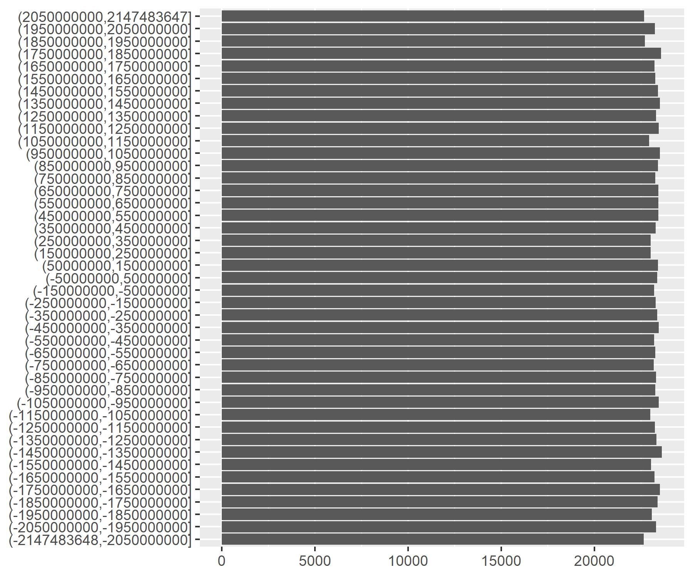

# RNG

## Important memory locations
RNG: 0x02193010 (NA1.0) | 0x02195DC0 (NA1.1) | 0x02176F68 (CuteNA)

## Exploring the RNG values

The RNG memory value is a 4 byte signed integer that updates every frame (60 frames per second). It ranges from -2,147,483,648 to 2,147,483,647. It is randomly distributed (see chart below). The RNG value is updated every frame (60 times per second) while the game runs.

### Distribution of the RNG value, in 100,000,000 bins, 1 million attempts

The seed of the RNG is initiated 10 frames after clicking “new game” and based on the hour, minute and second of the DS clock and another factor (probably number of frames since start of the game). The date (year, month or day) and the millisecond does not affect the RNG seed. There is a bug where if any of the 3 important values (year, month or day) is set to 0, the DS will give the same RNG. This is the seed that most speedruns are run on since it is well known and documented (see https://imgur.com/a/YmBEdhv).

Things known to be affected by RNG:
* Weather (deciding when sleeping for weather day after tomorrow)
* Floors in the mine (the configuration, how many floors you fall down, what cursed tool you collect)
* Location of hidden water sprite (decided right after selecting new game)
* Spawn of all items on the farmland (wood, stone, grass… - decided during sleeping the night before)
* Value of items at Gotz shop
